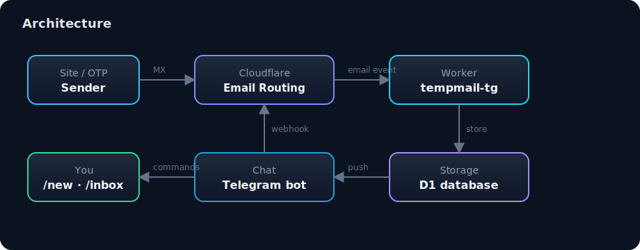

<p align="center">
  
</p>

<p align="center">
  
</p>

<h1 align="center">tempmail-tg</h1>

<p align="center">
  <strong>Self-owned temporary email + Telegram bot</strong><br/>
  Fully on <strong>Cloudflare Workers + D1 + Email Routing</strong> — no VPS.
</p>

<p align="center">
  <a href="LICENSE"></a>
  
  
  
  
</p>

Create disposable addresses on **your** domain (`otp@your-domain`), receive OTP / verification links, and read them in Telegram. Multi-domain (swap domains without rewriting the bot). Private whitelist first; multi-user optional.

## Features

| | |
|---|---|
| ✉️ **Disposable addresses** | `/new` — random local-part on an active domain (or `/new domain.com`) |
| 🔔 **Push on inbound** | Telegram notify + best-effort OTP / link extraction |
| 📥 **Inbox tools** | `/inbox`, `/read`, `/list`, `/del` |
| 🌐 **Multi-domain** | `/adddomain` / `/offdomain` (admin) — burn a domain without bot rewrites |
| 🔌 **HTTP API** | Create address + read inbox (per-address bearer token) |
| ☁️ **Pure Cloudflare** | Workers + D1 + Email Routing — no mail VPS |

## Architecture

<p align="center">
  
</p>

```
Site/OTP ──MX──► Cloudflare Email Routing (catch-all)
                        │
                        ▼
              Worker tempmail-tg  ──►  D1
                        ▲
              Telegram webhook ──┘
```

## Bot commands

| Command | Action |
|---|---|
| `/start` | Auth + help |
| `/new [domain]` | Create temp address |
| `/list` | Your active addresses |
| `/inbox [address\|id]` | Last 10 mails |
| `/read <mail_id>` | Full body + OTP/links |
| `/del <address\|id>` | Soft-delete address |
| `/domains` | Active domains |
| `/adddomain` `/offdomain` `/adduser` | Admin |

## Limits (v1)

- 20 active addresses per user
- 100 mails per address (FIFO)
- 10 `/new` per hour per user
- Body truncated at 50KB

## Quick setup

### 1. Clone & install

```bash
git clone https://github.com/yxxrn/tempmail-tg.git
cd tempmail-tg
npm install
```

### 2. Cloudflare login + D1

```bash
npx wrangler login
npx wrangler d1 create tempmail
```

Paste the `database_id` into `wrangler.toml` → `[[d1_databases]].database_id`.

### 3. Secrets & vars

```bash
cp .dev.vars.example .dev.vars
# fill BOT_TOKEN, WEBHOOK_SECRET, API_KEY, ALLOWED_CHAT_IDS

npx wrangler secret put BOT_TOKEN
npx wrangler secret put WEBHOOK_SECRET
npx wrangler secret put API_KEY
```

Set `ALLOWED_CHAT_IDS` (your Telegram chat id) in `wrangler.toml` `[vars]` or the Worker dashboard.

### 4. D1 migrations

```bash
npm run db:local    # dev
npm run db:remote   # production
# optional seed:
# edit scripts/seed.sql then:
# npx wrangler d1 execute tempmail --remote --file=scripts/seed.sql
```

### 5. Domain + Email Routing

1. Domain on Cloudflare (zone **Active**)
2. **Email** → **Email Routing** → Enable (MX auto-added)
3. **Catch-all** → **Send to a Worker** → `tempmail-tg` → Enable

### 6. Deploy + webhook

```bash
npx wrangler deploy
```

```bash
curl "https://api.telegram.org/bot$BOT_TOKEN/setWebhook" \
  -d "url=https://tempmail-tg.<subdomain>.workers.dev/api/telegram" \
  -d "secret_token=$WEBHOOK_SECRET"
```

### 7. Use

Telegram bot → `/start` → `/adddomain your.domain` → `/new`

## Multi-domain

1. New domain on CF + Email Routing catch-all → **same Worker**
2. Bot: `/adddomain other.com`
3. `/new` picks a **random** active domain
4. Disable: `/offdomain old.com`

You do not need a second domain unless you want a backup or the first is blocked.

## HTTP API

| Method | Path | Auth |
|---|---|---|
| `GET` | `/health` | — |
| `POST` | `/api/new` | `X-API-Key` |
| `GET` | `/api/inbox?address=` | `Authorization: Bearer <address.token>` |
| `GET` | `/api/mail/:id` | Same bearer |
| `POST` | `/api/telegram` | `X-Telegram-Bot-Api-Secret-Token` |

`POST /api/new` optional body:

```json
{ "domain": "example.com", "owner_chat_id": "123456789" }
```

## Dev

```bash
npm test
npm run typecheck
npm run dev
```

## Layout

```
src/
  index.ts          # fetch + email entrypoints
  bot.ts            # Telegram commands
  email_handler.ts  # inbound mail → D1 → push
  api.ts            # HTTP routes
  db.ts             # D1 helpers
  auth.ts / limits.ts / otp.ts / ids.ts
assets/
  banner.svg        # README hero
  architecture.svg  # diagram
  logo.svg
migrations/
  0001_init.sql
docs/
  USER_GUIDE.md / DEPLOY.md / API.md
```

## Docs

| File | Content |
|---|---|
| [docs/USER_GUIDE.md](docs/USER_GUIDE.md) | Bot usage + multi-domain |
| [docs/DEPLOY.md](docs/DEPLOY.md) | Production deploy checklist |
| [docs/API.md](docs/API.md) | HTTP API reference |
| [docs/superpowers/specs/2026-07-19-tempmail-tg-design.md](docs/superpowers/specs/2026-07-19-tempmail-tg-design.md) | Design spec |
| [docs/superpowers/plans/2026-07-19-tempmail-tg.md](docs/superpowers/plans/2026-07-19-tempmail-tg.md) | Implementation plan |

## Security

- Do not commit `.dev.vars`, secrets, or production chat ids
- Secrets only via `wrangler secret`
- Private bot: whitelist `ALLOWED_CHAT_IDS` + `users` table
- Rotate BotFather / CF API tokens if they ever leak

## License

[MIT](LICENSE)
